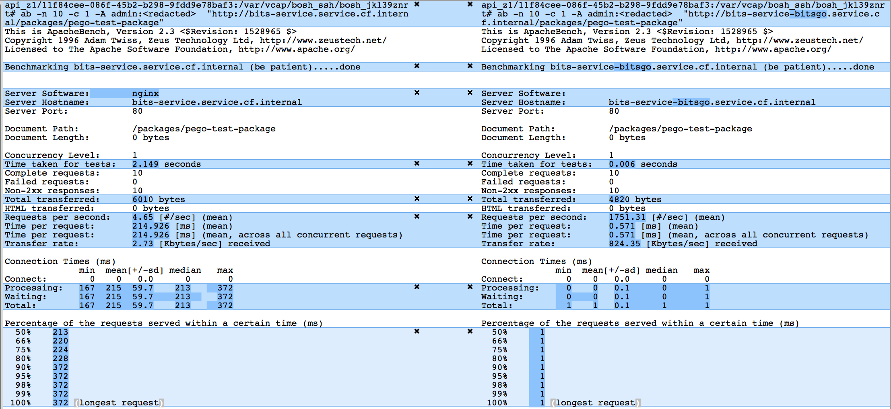
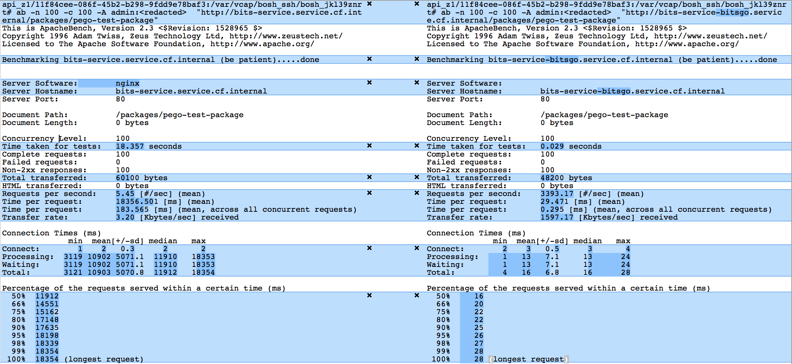

# Performance Comparison

## Speed

The performance test was done in an AWS environment with an S3 blobstore backend. The bits-service was deployed as one VM with the Ruby implementation in it, and another VM with the Go implementation in it.

### GET requests

GET requests are about **3 orders of magnitude faster** in this Go implementation than in the [original Ruby implementation](https://github.com/cloudfoundry-incubator/bits-service).

#### 100 requests with concurrency 10:

#### 10 requests with concurrency 1:

#### 100 requests with concurrency 100:

### PUT requests

PUT requests are about **2 orders of magnitude faster** in this Go implementation than in the [original Ruby implementation](https://github.com/cloudfoundry-incubator/bits-service) when doing 100 requests with concurrency 10:

## Memory Consumption

### Ruby Implementation

The [Ruby implementation](https://github.com/cloudfoundry-incubator/bits-service) uses more or less by default 1GB of memory.

### Go

TBD

