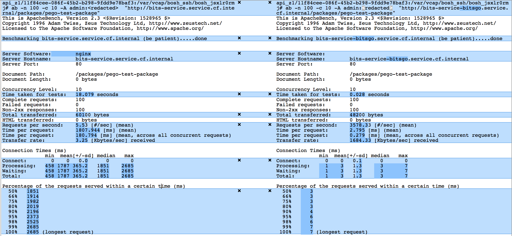
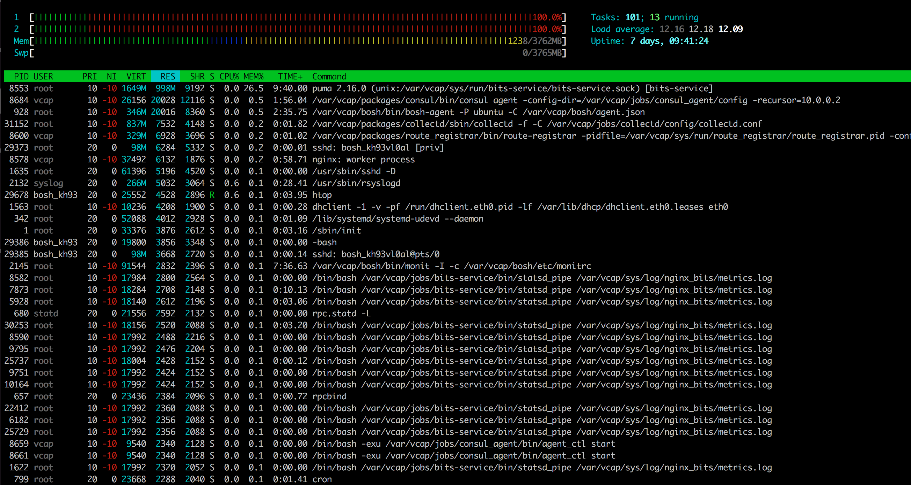

# Performance Comparison

## Speed

### GET requests

GET requests are roughly **1000x faster** in this Go implementation than in the [original Ruby implementation](https://github.com/cloudfoundry-incubator/bits-service):

### PUT requests

TBD

## Memory Consumption

### Ruby:

The [Ruby implementation](https://github.com/cloudfoundry-incubator/bits-service) uses more or less by default 1GB of memory.

